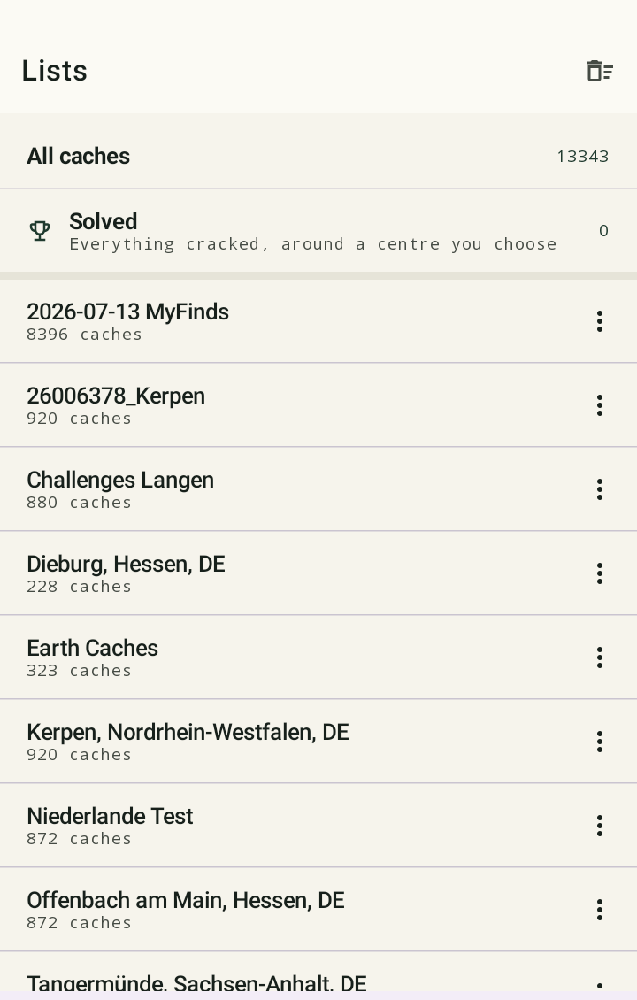
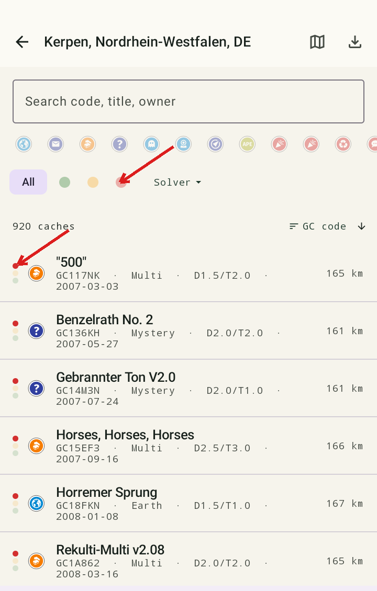
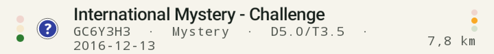
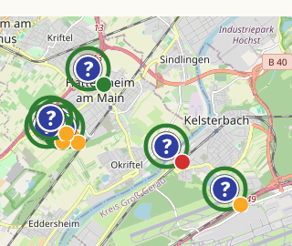
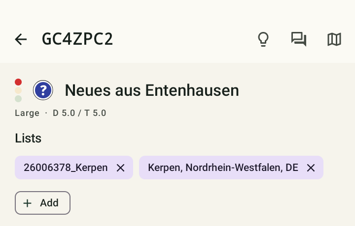
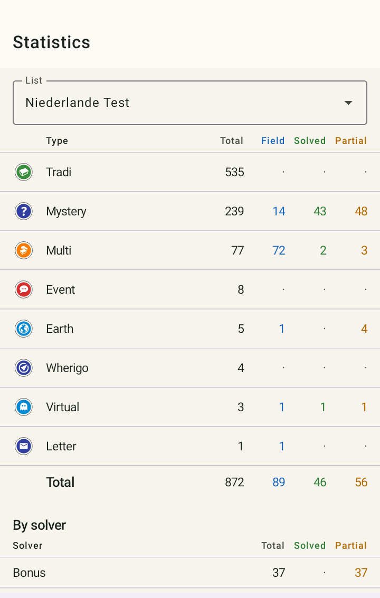

# Base de données, listes et statistiques

## Lists

L'onglet de démarrage affiche toutes tes listes importées ainsi que deux entrées fixes :
**« All caches »** (toutes les caches réunies) et **« Solved »** (toutes les caches résolues
autour d'un point central que tu choisis).

<figure class="gcms-shot" markdown>

<figcaption>Lists — écran d'accueil</figcaption>
</figure>

## Liste des caches

En touchant une liste, tu ouvres une liste de caches consultable et filtrable — par couleur de
feu tricolore, type de cache et plus encore. C'est de là que tu ouvres la page de détail d'une
cache.

<figure class="gcms-shot" markdown>

<figcaption>À gauche : feu tricolore par cache. En haut : filtre par type de cache, filtre par couleur, filtre par solveur</figcaption>
</figure>

- La **flèche rouge du haut** pointe vers la barre de filtres : icônes de type de cache, les trois
  couleurs de feu tricolore (vert/jaune/rouge) à afficher/masquer, et un menu déroulant
  **« Solver »** pour filtrer par solveur spécifique.
- La **flèche rouge en bas à gauche** pointe vers le petit **feu tricolore à trois points sur le
  bord gauche de chaque cache** — la couleur actuelle est pleine, les deux autres points restent
  pâles. Le même code rouge/jaune/vert que partout ailleurs dans l'application.

### Deux feux tricolores indépendants : statut de résolution et statut de challenge

Pour les challenge caches, **deux** feux tricolores peuvent être visibles en même temps — un à
gauche, un à droite du bord de la ligne :

<figure class="gcms-shot" markdown>

<figcaption>Gauche : statut de résolution (ici vert). Droite : accomplissement du challenge (ici jaune/partiel)</figcaption>
</figure>

- **Gauche = statut de résolution** : la condition de la cache (par ex. le texte du challenge) a-t-elle
  été reconnue, et la solution/l'évaluation est-elle fiable ?
- **Droite = accomplissement du challenge** : tes trouvailles existantes remplissent-elles déjà la
  condition reconnue ? (Voir [Vérification des challenges](challenges.md) pour les détails de
  cette seconde évaluation, indépendante.)

## Détail d'une cache

Sur la page de détail d'une cache, tu trouves le listing, l'indice, la solution actuelle, la
couleur du feu tricolore ainsi que — tous regroupés dans **une seule carte « Solver results »** —
les boutons supplémentaires pertinents pour cette cache : par ex. un lien vers un Geochecker, vers
gc-project (si le listing en propose un), ou vers une page d'enregistrement webcam pour les
webcam caches.

## Map

L'onglet carte affiche la liste actuellement sélectionnée sous forme de marqueurs sur une carte
OpenStreetMap. Chaque marqueur combine deux informations :

- **Le symbole du type de cache** au centre (par ex. « ? » pour Mystery, une icône de livre pour
  Traditional).
- **Un anneau coloré** autour du symbole dès qu'un statut de résolution existe : **vert** =
  solution fiable (confiance ≥ 90 %), **jaune/ambre** = solution incertaine/partielle. Pas
  d'anneau signifie : toujours non résolue.

<figure class="gcms-shot" markdown>

<figcaption>Les marqueurs « ? » entourés de vert sont des mystery caches résolues</figcaption>
</figure>

Pour les challenge caches, un petit **badge en bas à droite du marqueur** s'ajoute — c'est
l'accomplissement du challenge (le même second feu tricolore que dans la liste, voir ci-dessus),
indépendant du statut de résolution de l'anneau. Avec beaucoup de marqueurs proches les uns des
autres, l'application passe automatiquement à un mode point plus compact, où la couleur du type de
cache remplit la surface et le statut de résolution apparaît sous forme d'un fin anneau autour.

### Cartes hors ligne

L'icône de calques en haut à droite te permet de basculer entre la carte en ligne (OpenStreetMap)
et une **carte hors ligne (fichier .map)** que tu as chargée toi-même — pratique pour une
utilisation sans connexion Internet. De tels fichiers `.map` peuvent être téléchargés par ex. avec
**c:geo**, et sont ensuite aussi disponibles ici pour sélection.

<figure class="gcms-shot" markdown>

<figcaption>Sélection carte en ligne/hors ligne</figcaption>
</figure>

## Statistiques

L'écran des statistiques t'indique, par type de cache, combien de caches sont résolues,
partiellement résolues et reconnues comme énigmes de terrain au total — tu vois ainsi d'un coup
d'œil où il reste du travail et où une visite sur place est de toute façon incontournable.

<figure class="gcms-shot" markdown>

<figcaption>Statistiques par type de cache, avec une répartition « By solver » en dessous</figcaption>
</figure>

!!! tip "Directement vers la liste filtrée"
    Toucher une ligne de type de cache dans le tableau des statistiques (par ex. « Mystery »)
    t'amène directement à la liste des caches, déjà filtrée sur exactement ce type.

## Sauvegarde et restauration

Dans *Setup*, tu peux sauvegarder toute ta base de données (y compris tous les paramètres) et la
restaurer sur un autre appareil. Détails : [Paramètres et sauvegarde](einstellungen-backup.md).
