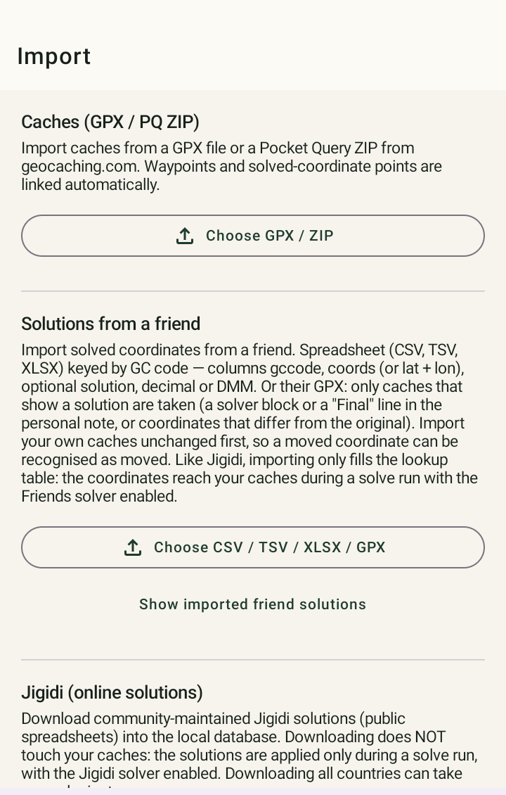

# Import et export (GPX / PocketQuery)

<figure class="gcms-shot" markdown>

<figcaption>Onglet Import</figcaption>
</figure>

## Fichiers pris en charge

- Des **fichiers GPX** individuels, tels qu'exportés par geocaching.com ou c:geo pour une cache
  ou une liste.
- Des **PocketQuery** (également au format GPX) avec jusqu'à plusieurs centaines de caches d'un
  coup.

Les caches déjà présentes sont **mises à jour** lors d'un nouvel import, pas dupliquées — tu peux
donc réimporter la même liste aussi souvent que tu veux, par exemple pour récupérer ton statut de
trouvaille actuel.

## Nom de la liste

Avant l'import, tu saisis un **nom de liste libre** (pré-rempli avec le nom du fichier ; si tu le
laisses vide, la liste s'appelle « import »). Deux cas :

- **Nouveau nom** : une nouvelle liste portant ce nom est créée.
- **Nom d'une liste existante** : les caches importées sont ajoutées à cette liste — aucune liste
  ni aucune cache en double n'est créée.

Il existe aussi une option **« Rename list by region (from cache locations) »** — après l'import,
l'application détermine automatiquement un nom à partir des coordonnées des caches (détection de
cluster + recherche du lieu), par ex. « Kerpen, Nordrhein-Westfalen, DE ».

!!! warning "Pas pour les PocketQuery MyFinds"
    Dans une PocketQuery MyFinds, tes trouvailles sont dispersées dans le monde entier — un
    renommage automatique par région ne donnerait ici aucun nom pertinent. Pour ce genre de
    liste, donne plutôt le nom toi-même (par ex. « MyFinds »).

## Ce qui se passe automatiquement à l'import

1. **Détection du statut de trouvaille** : une PocketQuery dont le nom commence par « my finds »
   est reconnue automatiquement — toutes les caches qu'elle contient sont marquées trouvées
   (message : *« Recognised as a My Finds query — all of them marked found. »*). Dans les
   PQ/fichiers GPX normaux, l'application reconnaît en plus tes propres entrées de log « Found
   it »/« Attended »/« Webcam Photo Taken » en les comparant au **username** geocaching.com
   enregistré dans *Setup*. Une fois qu'une cache est reconnue comme trouvée, elle le reste à
   chaque import ultérieur.
2. **Résolution de la région** (hors ligne, sans accès Internet) : le pays, la région et le
   département sont déterminés à partir des coordonnées de la cache.
3. **Pré-vérification des challenges** : pour toutes les caches reconnues comme un challenge,
   l'évaluation par feu tricolore est calculée immédiatement (voir
   [Vérification des challenges](challenges.md)) — pas seulement à l'ouverture de la cache.
4. **Résolution de l'altitude en arrière-plan** : les altitudes sont récupérées sans bloquer
   l'application. Pour de très gros imports, cela peut continuer en arrière-plan pendant un
   moment.

!!! tip "PQ MyFinds pour une évaluation correcte des challenges"
    La vérification des challenges ne compte que les trouvailles déjà présentes dans ta base de
    données locale — il n'y a aucune comparaison en ligne avec ton historique réel. Pour des
    résultats fiables sur les challenges de nombre de trouvailles/Jasmer/365 jours/streak, importe
    donc une fois ta **PocketQuery MyFinds** complète (voir
    [Vérification des challenges](challenges.md)).

## Solutions et notes existantes

- **Les solutions ne sont jamais écrasées** : une solution déjà enregistrée survit à un nouvel
  import. Ce n'est que si le GPX importé contient lui-même un bloc `[GCMystSolver]` plus récent
  (par ex. parce que tu relis un fichier déjà exporté par GCMystSolver) que l'application adopte
  cette solution plus récente.
- **Les notes personnelles sont fusionnées, pas remplacées** : ton propre texte libre de la note
  personnelle du GPX est conservé et ajouté sous le bloc `[GCMystSolver]` généré automatiquement —
  rien ne se perd, et les imports/exports répétés n'empilent pas le bloc plusieurs fois.

## Principe de base : hors ligne avant le réseau

Dans la mesure du possible, GCMystSolver utilise des **données locales et des références
hors ligne** pour l'import et pour la résolution de la région/altitude, avant tout accès réseau.
Cela rend l'import fiable et rapide, même pour de grandes listes.

## Le chemin le plus rapide depuis c:geo

1. Dans la vue détaillée d'une liste sous c:geo, ouvre le menu → **« Exporter/Envoyer »** →
   **« Exporter en GPX »**.
2. Dans GCMystSolver, va dans *Import* et, dans le sélecteur de fichiers, navigue jusqu'au
   dossier d'export de c:geo (généralement `\cgeo\gpx`).
3. Dans le menu à trois points du sélecteur de fichiers, choisis **« Trier par »** →
   **« Date de modification (plus récent en premier) »**.
4. Charge le fichier GPX tout en haut (le plus récent).

Avec plus de 100 fichiers GPX dans le dossier d'export de c:geo, le bon fichier serait sinon
difficile à retrouver.

## Export

Via **« Export GPX »** (dans *Lists*, dans une liste de caches, ou dans la liste « Solved »), tu
réécris tes caches — y compris les résultats de GCMystSolver — dans un fichier GPX, par ex. pour
les réutiliser dans c:geo ou une autre application.

- **Coordonnée résolue** : si une cache est résolue, la coordonnée du waypoint exporté est
  directement réglée sur la position résolue (pas de waypoint « Final » séparé — la cache
  elle-même « se déplace » vers la solution dans l'export).
- **Solution dans la note personnelle** : la solution (coordonnée d'origine, coordonnée résolue,
  confiance, solve type, lien checker) se retrouve dans un bloc `[GCMystSolver]` au sein de la
  note personnelle de la cache exportée — immédiatement suivi de ton propre texte de note.

Dans *Setup → Export privacy*, tu peux atténuer deux détails de ceci :

- **« Show AI model in export »** : désactivé, pour qu'une solution IA n'affiche que « AI » au
  lieu de par ex. « AI (gemini-2.5-flash) ».
- **« Show [GCMystSolver] tag in export »** : désactivé, pour que l'export ne contienne **que ton
  propre texte de note** — sans confiance, solve type ni texte de solution. La coordonnée résolue
  elle-même est toujours exportée, indépendamment de ce réglage.
