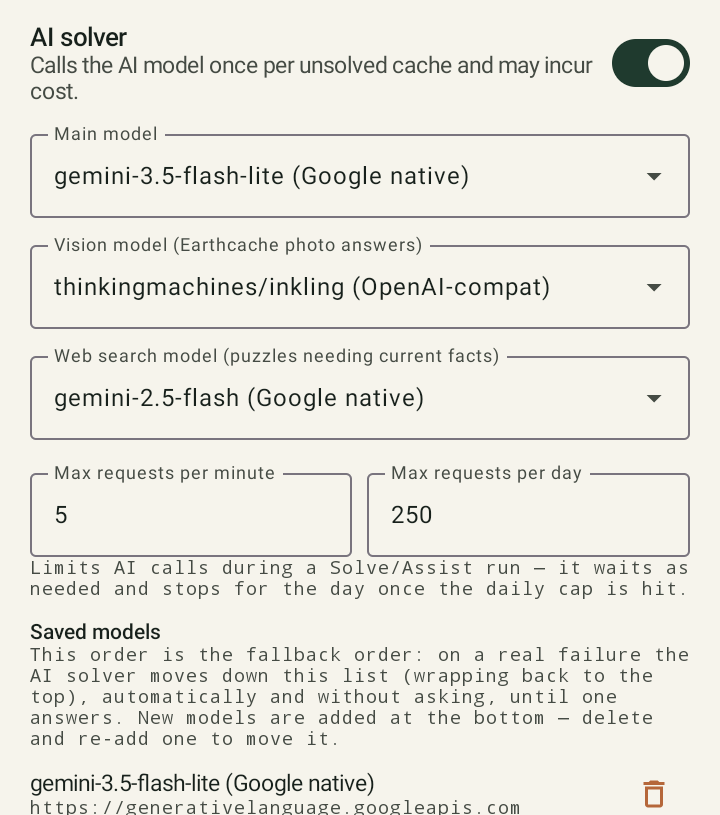
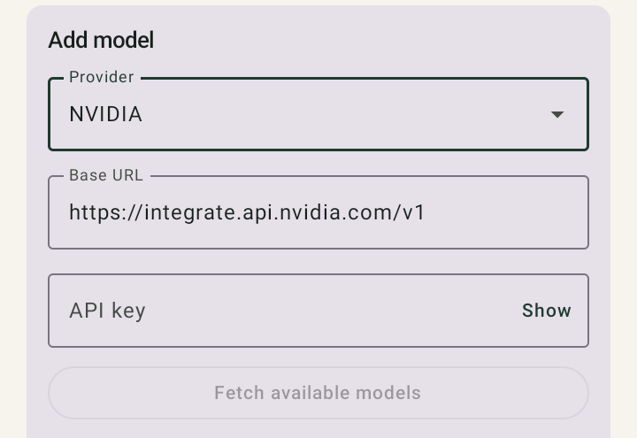

# Řešení pomocí AI

Pokud žádný z [automatických řešičů](solver.md) nenajde shodu a hádanka není rozpoznaná terénní
hádanka, může GCMystSolver volitelně přizvat na pomoc připojenou AI.

## Předpoklad

Potřebuješ vlastní API klíč od podporovaného poskytovatele AI, který uložíš v *Setup*. Bez
uloženého klíče aplikace dál funguje — jen bez AI modulu, čistě s automatickými řešiči.

## Doporučení: začni zdarma s NVIDIA nebo Google Gemini

GCMystSolver sám o sobě žádný přístup k AI nenabízí — potřebuješ vlastní API klíč. Pro začátek se
obzvlášť hodí dva poskytovatelé, protože nabízejí **bezplatný limit využití bez kreditní karty**:

- **[Google Gemini](https://aistudio.google.com/)** (Google AI Studio): s Google účtem si během
  pár kliknutí vytvoříš bezplatný API klíč ("Get API key"). Bezplatná úroveň bohatě stačí na
  běžné používání aplikace.
- **[NVIDIA](https://build.nvidia.com/)** (katalog NVIDIA API): s bezplatným účtem získáš přístup
  k mnoha hostovaným modelům přes rozhraní kompatibilní s OpenAI — rovněž použitelné bez kreditní
  karty.

Oba jsou v GCMystSolver už uloženi jako hotová **přednastavení** (viz návod krok za krokem níže) —
základní URL tak nemusíš hledat ručně.

!!! tip "Přidej více modelů"
    Protože aplikace při neúspěchu automaticky přejde na další uložený model (viz
    [Rotace modelů](#rotace-modelu-misto-pevneho-zalozniho-modelu) níže), vyplatí se zadat
    například jak model od Gemini, tak od NVIDIA — když se u jednoho vyčerpá limit, automaticky
    převezme druhý poskytovatel.

### Krok za krokem

1. Na [aistudio.google.com](https://aistudio.google.com/) resp.
   [build.nvidia.com](https://build.nvidia.com/) vytvoř a zkopíruj bezplatný API klíč.
2. V GCMystSolver přejdi do **Setup** a zapni přepínač **"AI solver"**.
3. V sekci **"Add model"**:
      - U **"Provider"** vyber *Google Gemini* nebo *NVIDIA* (Base URL se vyplní automaticky).
      - Vlož zkopírovaný klíč do pole **"API key"**.
      - Klepni na **"Fetch available models"** — aplikace načte seznam dostupných modelů.
      - Vyber model v poli **"Model"**.
      - Ulož pomocí **"Save model"**.
4. Uložený model se teď objeví v seznamu **"Saved models"** a automaticky se použije jako
   **"Main model"**, pokud ještě žádný nebyl nastaven.
5. Volitelně: krok 3 zopakuj pro druhého poskytovatele — oba pak skončí v pořadí náhradního
   řešení.

<figure class="gcms-shot" markdown>

<figcaption>Zapnutí AI solver, modely a limity</figcaption>
</figure>

<figure class="gcms-shot" markdown>

<figcaption>Výběr poskytovatele v dialogu "Add model"</figcaption>
</figure>

## Rotace modelů místo pevného záložního modelu

V *Setup* si uložíš seznam vlastních modelů. Selže-li požadavek (např. protože je poskytovatel
přetížený), aplikace automaticky bez ptaní zkusí další model ze seznamu. Teprve když je bez
úspěchu vyzkoušen **celý seznam** pro jeden požadavek, zobrazí se hláška s možnostmi *Cancel* nebo
*Continue*.

V *Setup → Test models* můžeš otestovat každý uložený model jednotlivě.

## Hrubý odhad nákladů

Průvodce nastavením ukazuje hrubý odhad tokenového rozpočtu: na jednu keš, kterou se AI skutečně
pokusí vyřešit, připadá zhruba 900–1 000 tokenů; na celou PocketQuery s ~1 000 kešemi typicky
několik desítek tisíc až asi 200 000 tokenů — v závislosti na tom, kolik keší se vůbec dostane až
do fáze AI (automatické řešiče zachytí většinu z nich už předtím).

## Transparentnost řešení

Návrh řešení od AI se vždy zobrazí spolu s odůvodněním a je označen jako **nejisté (žluté)**,
dokud ho nepotvrdíš nebo neopravíš — nikdy automaticky nepřepíše řešení už označené jako
spolehlivé.
