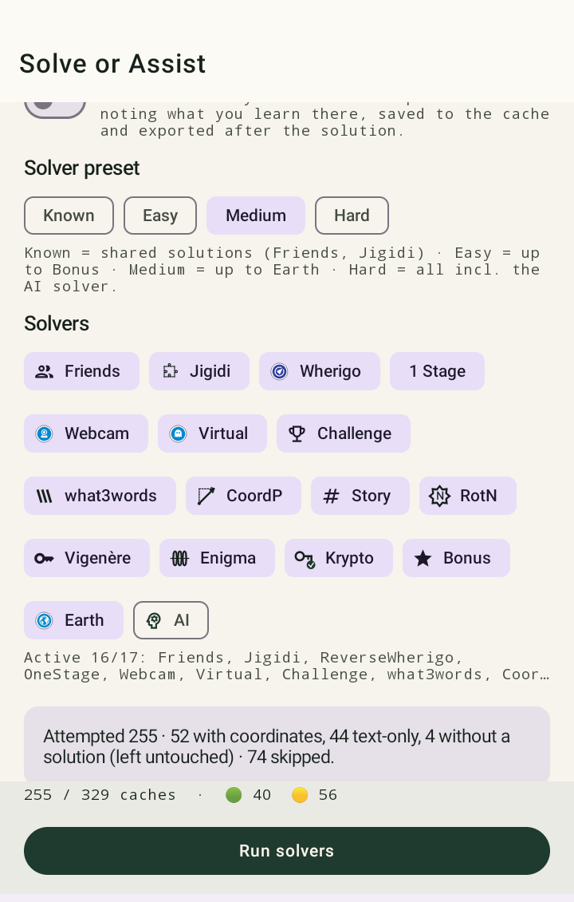

# Automatické řešiče

Ještě než se vůbec zeptá AI, zkusí GCMystSolver tvou hádanku rozlousknout pomocí řady vestavěných,
klasických luštitelů. Je to rychlejší, zdarma a funguje to i úplně bez připojené AI.

Na kartu *Solve* se dostaneš buď přímo přes spodní navigaci (luštění nad celým seznamem), nebo
přes výslovné tlačítko Solve na detailní stránce jedné keše (vyřeší jen tuto jednu keš, bez ohledu
na zvolený režim řešení).

<figure class="gcms-shot" markdown>

<figcaption>Režim řešení, přednastavení a jednotlivě zapínatelné chipy řešičů</figcaption>
</figure>

## Co se rozpozná

| Řešič | Rozpoznává |
|---|---|
| **what3words** | Souřadnice ze tří slov (`///slovo.slovo.slovo`) |
| **Vigenère** | Text zašifrovaný Vigenèrovou šifrou, včetně rozpoznání klíče |
| **ROT-N** | Caesarovy/ROT posuny, i s neznámým N |
| **Krypto (multi-dekodér)** | Běžné klasiky jako Base64, Morseovka, Atbash a další, v kombinaci |
| **Enigma** | Text zašifrovaný pomocí Enigmy |
| **Azimut/posun** | „Zaměř … stupňů, … metrů" i kompaktní zápis posunu N/E, v němčině/angličtině/nizozemštině/francouzštině/češtině |
| **Reverse-Wherigo** | Wherigo kartridže vyhodnocené pozpátku |
| **Číslice/číslovky ukryté v příběhu** | Souřadnice ukryté jako rozptýlené číslice nebo vypsané číslovky v souvislém textu |
| **Rozpoznání one-stage** | Rozpozná výslovné narážky „jednostupňová"/„one-stage"; u letterboxů navíc opatrnou heuristiku podle nepřímých indicií |
| **Jigidi** | Rozpozná nevyřešený odkaz na puzzle Jigidi a označí ho jako „automaticky řešitelné jen částečně" místo tichého předání AI (ta odkazovaný obrázek nevidí) |

Každý řešič transparentně uvádí, **co přesně rozpoznal** (např. rozpoznané číslo nebo text) —
chybná interpretace tak hned upoutá pozornost, místo aby se tvářila jako tiše špatná odpověď.

## Terénní hádanky vs. hádanky od gauče

GCMystSolver rozlišuje, zda je hádanka v zásadě řešitelná od stolu, nebo zda nutně vyžaduje
návštěvu na místě (např. multi s více stanovišti, azimut měřitelný až na prvním waypointu). Při
tvrdých důkazech terénní hádanky (např. výslovné číslování stanovišť v listingu nebo skutečné
waypointy v souboru GPX) se pokus o řešení pomocí AI neprovádí — aplikace by jinak jen hádala.

## Režim řešení

Při spuštění luštění vybíráš, které keše se zahrnou:

- **Unsolved (výchozí)**: jen opravdu nevyřešené (červené) keše, tvrdé terénní hádanky se
  přeskočí.
- **+ Partial**: navíc nejisté (žluté) výsledky, existující spolehlivá (zelená) řešení zůstávají
  nedotčena.
- **Force (vše)**: opravdu všechny keše, bez ohledu na barvu semaforu nebo stav nálezu — např. pro
  přepočítání řešení po aktualizaci řešiče.

Dále volíš **přednastavení** (od rychlého/pouze offline po intenzivní s AI), které určuje, jak
důkladně se hledá, než se osloví AI.

## Nalezené keše

Již nalezené keše se vždy zobrazují jako vyřešené (zelené), aniž by se znovu kontrolovaly.
