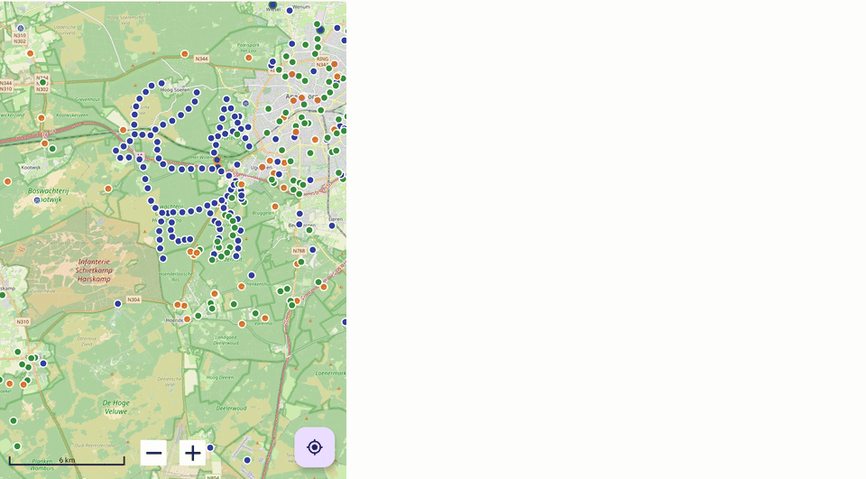

# GCMystSolver

**GCMystSolver** es una aplicación Android que te ayuda a resolver más rápido los mystery caches y
otros geocaches con enigma. Importas tus caches desde un archivo GPX o una PocketQuery, la
aplicación aplica automáticamente una cadena de solucionadores clásicos (Vigenère, ROT-N,
what3words, Enigma, decodificadores de criptografía, rumbo/proyección y más) y además puede
recurrir a una IA cuando ningún solucionador integrado encaja. Además, la aplicación comprueba
automáticamente si tus caches encontrados cumplen los requisitos de los challenge caches (matriz
D/T, países, regiones, altitud, número de hallazgos y más).

Este manual describe en detalle todas las funciones de la aplicación. Usa la navegación de arriba
o la búsqueda para encontrar un tema.

<figure class="gcms-hero" markdown>

<figcaption>Un enigma geoart real (un ciervo formado por ~300 mystery caches en los Países
Bajos) — sin resolver a la izquierda, luego resuelto automáticamente por GCMystSolver, con un
primer plano de los anillos verdes de solución</figcaption>
</figure>

## Inicio rápido

- [Primeros pasos](erste-schritte.md) — instalar la app, hacer tu primera importación
- [Solucionadores automáticos](funktionen/solver.md) — qué tipos de enigmas resuelve la app sin IA
- [Verificación de challenges](funktionen/challenges.md) — cómo funciona la evaluación por semáforo de tus challenge caches
- [Soporte](support.md) — reportar un error o proponer una nueva función

## Bueno saberlo

!!! info "Gratis, sin versión premium"
    GCMystSolver actualmente no tiene funciones de pago ni funcionalidad restringida.

!!! warning "No sustituye tu propio razonamiento"
    Los solucionadores automáticos y la asistencia por IA son herramientas, no magia. En enigmas
    de campo (multis con varias etapas, rumbos tomados in situ, etc.), la aplicación no puede
    hacer más que indicarte el solucionador adecuado — al final siempre tendrás que resolver el
    cache en el lugar del escondite.

!!! note "Descargar la APK"
    El enlace a la APK actual está arriba en el menú ("APK herunterladen"). Es una compilación de
    depuración fuera de Play Store — tu dispositivo pedirá permiso para instalar apps de orígenes
    desconocidos la primera vez.
